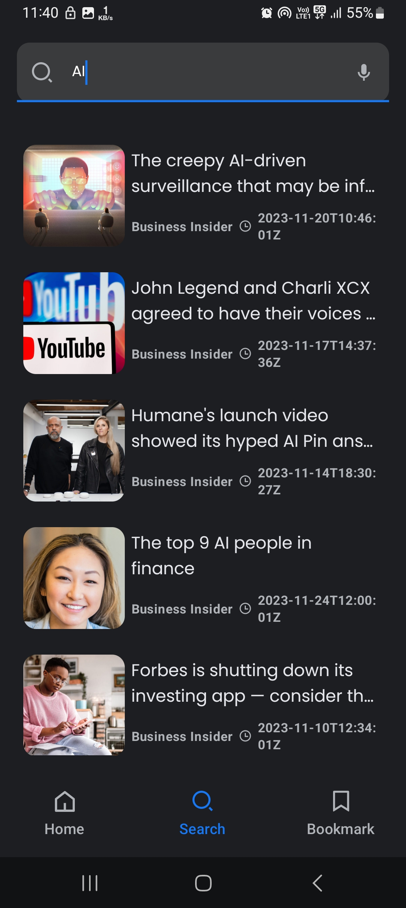
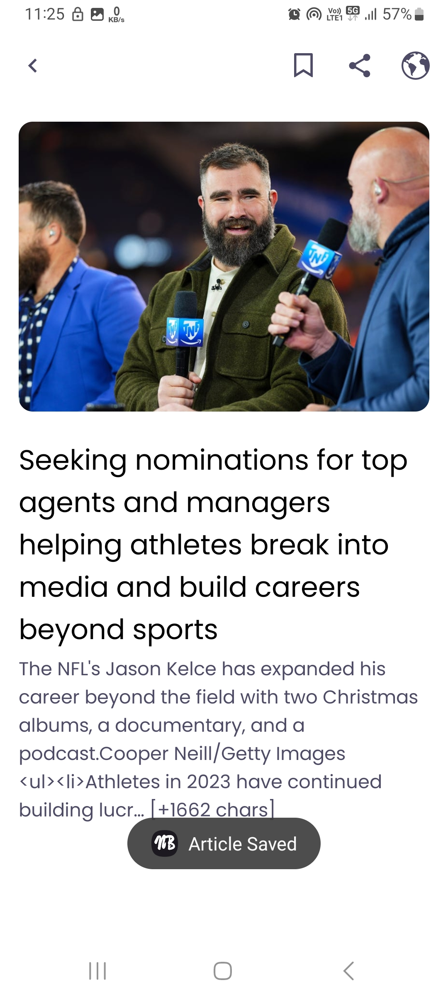
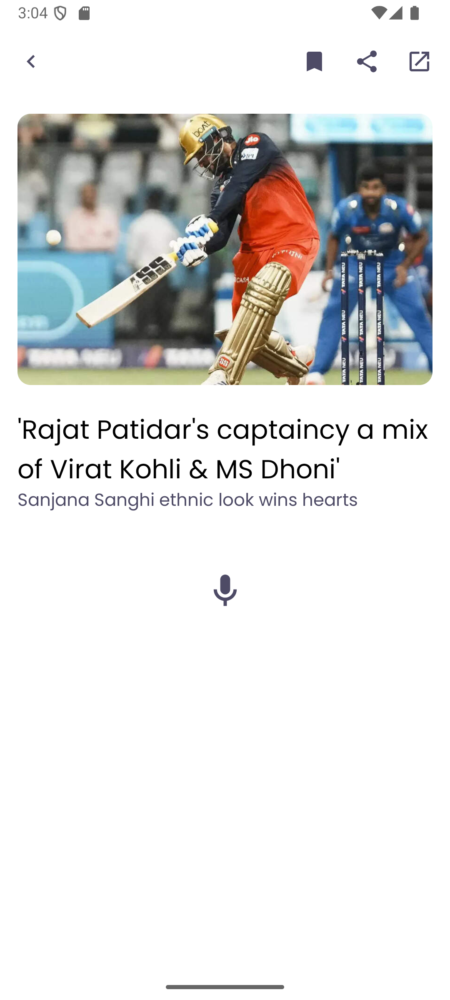
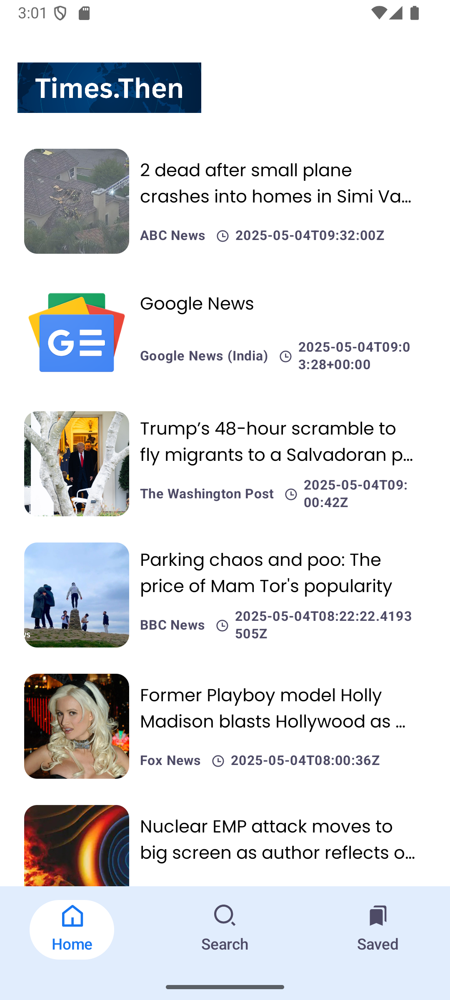
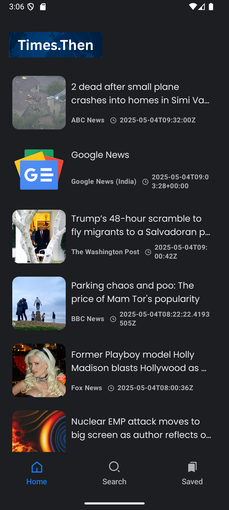
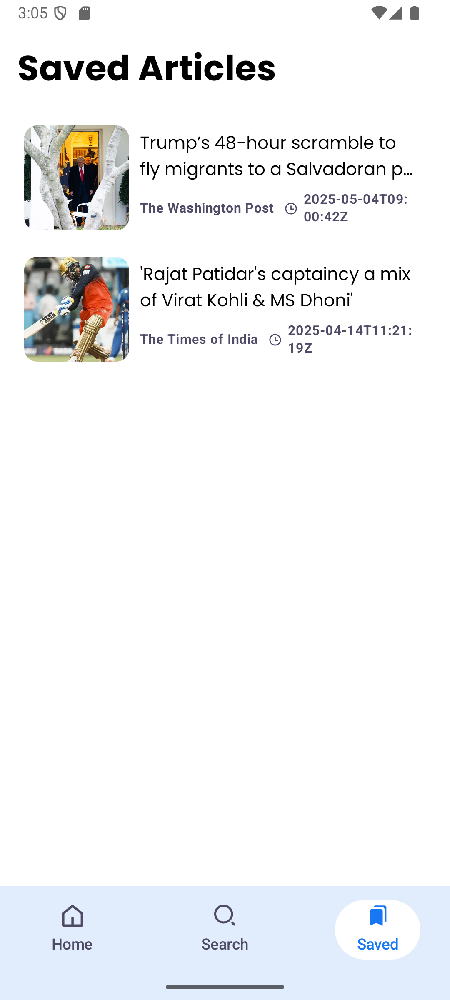
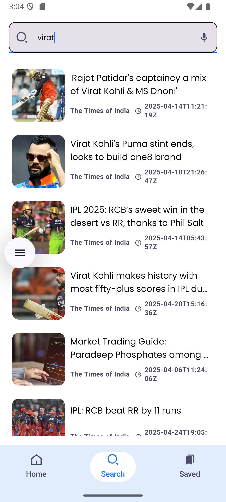
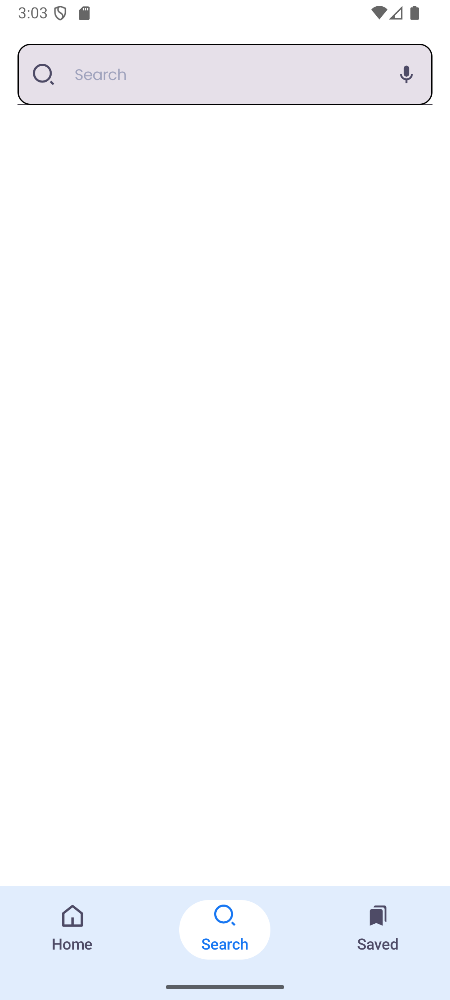

# NewsApp

**A modern, accessible news reader app for Android. Get breaking news, search with voice, save favorites, and listen to articles with text-to-speech.**

---

## Table of Contents

- [Overview](#overview)
- [Features](#features)
- [Screenshots](#screenshots)
- [Architecture](#architecture)
- [Tech Stack](#tech-stack)
- [Getting Started](#getting-started)
- [Configuration](#configuration)
- [Accessibility](#accessibility)
- [Testing](#testing)
- [Troubleshooting](#troubleshooting)
- [Contributing](#contributing)
- [License](#license)

---

## Overview

**NewsApp** delivers a seamless and accessible news reading experience on Android. Built with Jetpack Compose, it supports personalized news feeds, voice search, article saving, and text-to-speech. The app is structured using modern Android best practices, including clean architecture, dependency injection, and robust state management.

---

## Features

- **Onboarding Flow:** Guides new users through the app’s features and accessibility options.
- **Home Feed:** Browse curated, up-to-date headlines from major sources.
- **Search with Voice or Text:** Search for news using text input or speech-to-text (STT).
- **Bookmarks:** Save articles for later reading and manage your list of favorites.
- **Article Details:** Read full articles, share, open in browser, and listen via TTS.
- **Accessibility:** Listen to articles with Text-to-Speech and search using your voice.
- **Offline Support:** Saved articles are accessible offline.
- **Modern UI:** Built with Jetpack Compose and Material 3, supporting dark and light themes.
- **Paging:** Infinite scrolling for both news and search results.
- **Error & Loading States:** Friendly empty/error screens and shimmer loading effects.

---

## Screenshots
<h2>Screenshots</h2>

 









---

## Architecture

- **MVVM Pattern:** ViewModels manage UI logic and state.
- **Clean Architecture:**
   - **Data Layer:** Room Database, Retrofit API, DataStore for preferences.
   - **Domain Layer:** Use cases and repository interfaces.
   - **Presentation Layer:** Jetpack Compose UIs, ViewModels, Navigation.
- **Dependency Injection:** Dagger Hilt for lifecycle-safe dependency management.
- **Paging:** Android Paging 3 for efficient data loading and infinite scroll.

---

## Tech Stack

- **Language:** Kotlin
- **UI:** Jetpack Compose, Material 3
- **Navigation:** Jetpack Navigation Compose
- **Database:** Room
- **Networking:** Retrofit, Gson
- **Paging:** Paging 3
- **Dependency Injection:** Dagger Hilt
- **Preferences:** DataStore
- **Image Loading:** Coil
- **Accessibility:** Android TTS, STT APIs
- **Testing:** JUnit, Compose UI Testing

---

## Getting Started

### Prerequisites

- Android Studio Giraffe or newer
- Android SDK 33+
- Internet connection for news API

### Installation

1. **Clone the repository:**
```
   git clone https://github.com/lakshya-goel/Times.Then.git
   cd newsapp
```

2. **Open in Android Studio:**
- Select `Open an existing project` and choose the cloned directory.

3. **API Key:**
- The app uses [NewsAPI.org](https://newsapi.org/) for news data.
- Replace the placeholder in `Constants.kt` with your own API key if needed.

4. **Build and Run:**
- Connect your device or start an emulator.
- Click **Run** or use `Shift + F10`.

---

## Configuration

- **Keystore:**  
  For release builds, add your keystore files under `app/keystores/` and configure signing in `build.gradle`.
- **API Base URL:**  
  Set in `Constants.kt`.
- **Database:**  
  Room database auto-initializes; no manual setup required.

---

## Accessibility

- **Text-to-Speech (TTS):**  
  Tap the speaker icon in the article detail screen to listen to the article content.
- **Speech-to-Text (STT):**  
  Tap the microphone icon in the search bar to search news by voice.
- **Inclusive Design:**  
  UI colors, typography, and navigation are optimized for accessibility and screen readers.

---

- **Compose UI Testing:**  
  See `androidTest/` for Compose UI test examples.

---

## Troubleshooting

- **App Crashes on Image Load:**
- Ensure all drawable resource files are valid, appropriately sized, and named in lowercase with underscores.
- Large image files can cause memory issues; resize images before adding to the project.
- **API Errors:**
- Check your NewsAPI key and network connection.
- **TTS/STT Issues:**
- Ensure device has Google TTS engine and microphone permissions enabled.

---

## Contributing

Contributions are welcome! Please open issues or submit pull requests for improvements, bug fixes, or new features.

---

## License

This project is licensed under the MIT License. See [LICENSE](LICENSE) for details.

---

*Inspired by modern Android best practices and clean architecture principles. For questions or support, open an issue on GitHub.*

